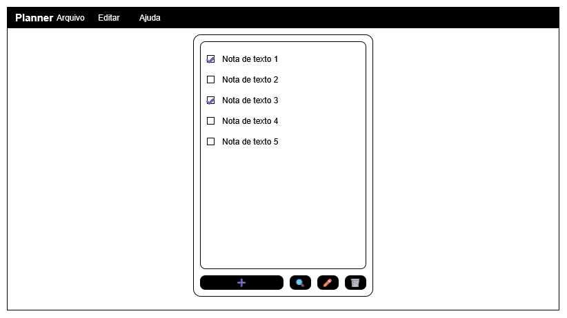

# Planner
Um gerenciador de hábitos simples

## Produto
Planner é um gerenciador de hábitos feito em JS, ele oferece opções de gerenciamento de uma lista de afazeres e as salva localmente em um arquivo XML

| | |
|-|-|
|Plataforma|Web|
|Tipo|Produtividade|
|Banco de Dados|Local|
|Dependencias|Nenhuma|
|Linguagens|JS, HTML, CSS|

## Tela

### Menus
- Arquivo
    - Novo
        - Cria uma nova lista de afazeres
    - Importar
        - Abre uma lista de afazeres de um arquivo
    - Exportar
        - Cria um arquivo apartir da lista de afazeres
- Editar
    - Adicionar
        - Adiciona um novo item a lista
    - Editar
        - Altera o nome e descrição dos itens selecionados
    - Deletar
        - Remove os itens selecionados
    - Selecionar tudo
        - Seleciona todos itens da lista
    - Pesquisar
        - Seleciona um item da lista apartir e uma busca por nome
- Ajuda
    - Sobre
        - Exibe informações do programa
    - Ajuda
        - Exibe a documentação

### Aparencia (CSS)
O software usa os [Principios de Design do GNOME](https://developer.gnome.org/hig/) como sua forma de estilização.